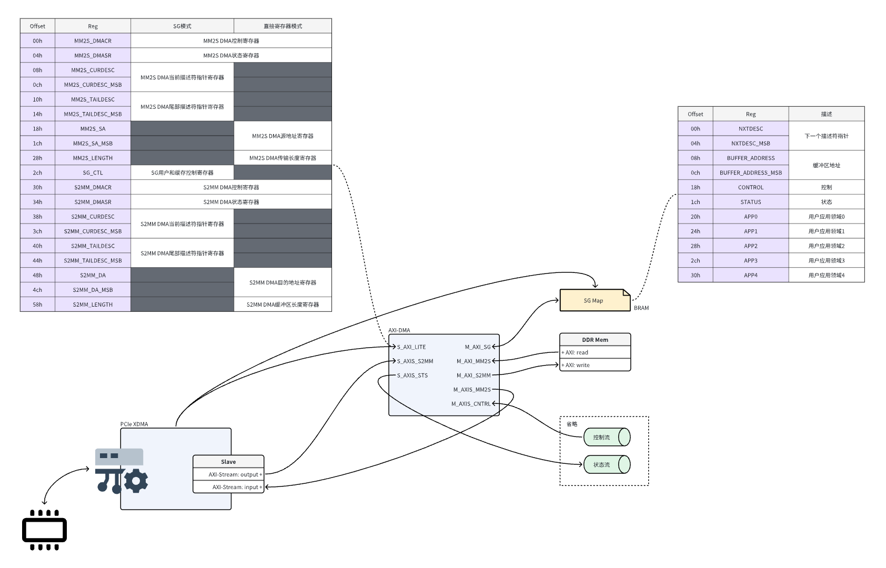

# Getting Started

This repository provides a comprehensive guide to working with the XDMA driver for DMA operations between host and device.

## Prerequisites

  * Ensure you have the necessary hardware and software environment set up, including the DMA IP drivers. [https://github.com/Xilinx/dma_ip_drivers](https://github.com/Xilinx/dma_ip_drivers)
  * Make sure you have the required permissions to execute commands and access devices.

## Instructions

``` bash
# 编译XDMA驱动并（临时）安装
cd external/dma_ip_drivers/XDMA/linux-kernel/xdma
make
sudo insmod xdma.ko
cd ../tools
make

# XDMA写入数据到DMA Stream端FIFO
rm -f *.bin
dd if=/dev/zero of=test0.bin bs=1024 count=1
xxd -p test0.bin | sed 's/00/01/g' | xxd -r -p > test2.bin
sudo ./dma_to_device -d /dev/xdma0_h2c_0 -f ./test2.bin -s 1024 -a 0 -c 1
sudo ./dma_to_device -d /dev/xdma0_h2c_0 -f ./test2.bin -s 1024 -a 0 -c 1
cd ../../../../..

# 添加可执行权限
sudo chmod +x dma_pre.sh
sudo chmod +x dma_h2c.sh
sudo chmod +x dma_c2h.sh

# 如有需要，改为Unix风格（去除行尾'\r'）
sed -i 's/\r//' dma_param.sh && sed -i 's/\r//' dma_pre.sh && sed -i 's/\r//' dma_h2c.sh && sed -i 's/\r//' dma_c2h.sh

# DMA写描述符
sudo ./dma_pre.sh

# DMA S2MM（H2C）传输
sudo ./dma_h2c.sh

# DMA MM2S（C2H）传输
sudo ./dma_c2h.sh

# XDMA读取DMA Stream端FIFO数据
cd external/dma_ip_drivers/XDMA/linux-kernel/tools
sudo ./dma_from_device -d /dev/xdma0_c2h_0 -f ./test3.bin -s 2048 -a 0 -c 1
xxd test3.bin
```

## Flow
<a href="fig/flow.png"></a>
